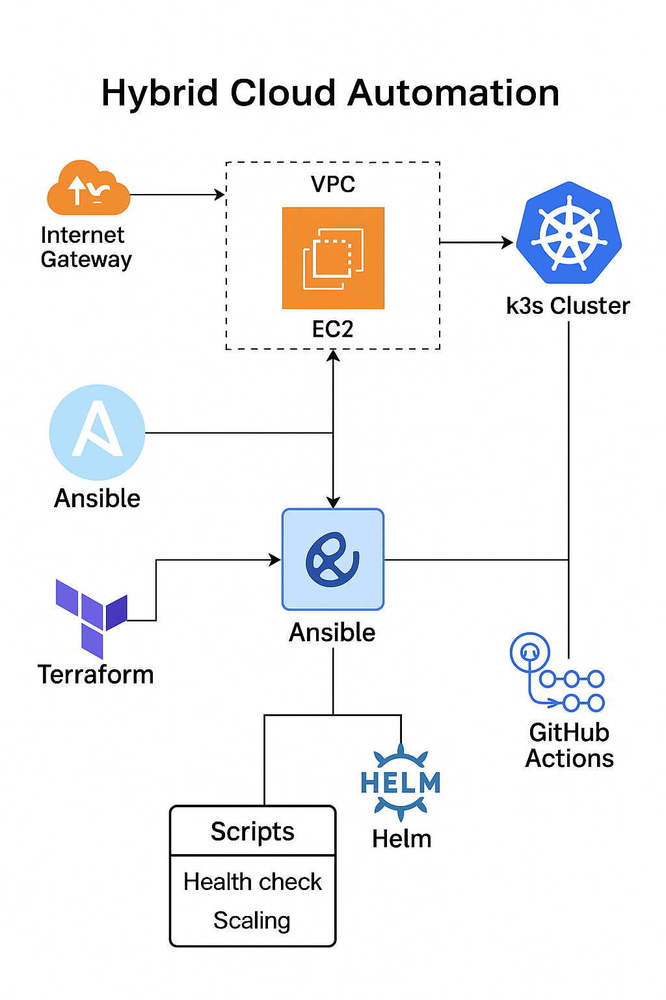

# 🚀 Hybrid Cloud Automation Lab

*A real-world reference implementation for Infrastructure-as-Code, Configuration Management, Kubernetes Automation & CI/CD.*

This repository demonstrates an end-to-end **Hybrid Cloud Platform Automation** workflow that provisions cloud infrastructure, configures systems, installs Kubernetes, deploys workloads, and integrates CI/CD automation — using modern DevOps tooling.

---

# 🏗️ 1. Architecture Overview

This project implements a fully automated cloud-native stack using:
- **Terraform** → AWS Infrastructure as Code
- **Ansible** → OS configuration, security hardening, Kubernetes installation
- **Kubernetes (k3s)** → Lightweight production-ready cluster
- **Helm** → Application packaging and deployment
- **GitHub Actions** → CI/CD pipeline for IaC and configuration validation
- **Python & Bash Scripts** → Health checks and basic scaling workflows

### 🔹 High-Level Automation Flow

**1. Terraform provisions:**
- VPC, subnet, route tables
- Internet Gateway
- Security groups
- EC2 instance(s)
- SSH restricted to your IP (`/32`)

**2. Ansible configures the nodes:**
- System updates & package installation
- Security hardening
- Install k3s
- Create monitoring namespace & ConfigMap

**3. Kubernetes (k3s) runs:**
- Demo application
- Services / Ingress (optional)

**4. Helm deploys applications declaratively**
**5. GitHub Actions automates validation steps**
**6. Scripts provide health checks and scale logic**

---

# ⚙️ 2. Getting Started

## 2.1 Prerequisites
Please install or prepare:
- Terraform ≥ 1.3
- Ansible ≥ 2.10
- AWS CLI (configured)
- SSH private key (PEM)
- kubectl
- Helm
- Python 3.x
- GitHub account (optional for CI/CD)

---

## 🏗️ 2.2 Provision Infrastructure (Terraform)

```bash
cd terraform
terraform init
terraform plan -out=tfplan
terraform apply tfplan
```

Terraform outputs:
- Public IP of the EC2 instance
- VPC/subnet details

---

## 🔧 2.3 Configure Instance & Install Kubernetes (Ansible)

Edit the inventory:

```
ansible/inventory.ini
```

Example:

```ini
[k8s_nodes]
ec2-node ansible_host=YOUR_EC2_IP ansible_user=ubuntu ansible_ssh_private_key_file=/path/to/key.pem
```

Run full automation:

```bash
cd ansible
ansible-playbook -i inventory.ini site.yml
```

This installs:
- OS baseline packages
- Security configuration
- k3s Kubernetes cluster
- Monitoring namespace and ConfigMap

---

## ☸️ 2.4 Deploy Applications (Kubernetes / Helm)

### Option A — Apply manifests directly
```bash
kubectl apply -f kubernetes/manifests/
```

### Option B — Deploy using Helm
```bash
cd helm/demo-chart
helm install demo . -n demo --create-namespace
```

---

# 🔄 3. CI/CD (GitHub Actions)

Workflow file:

```
.github/workflows/ci-cd.yml
```

Includes:
- Terraform format & validation
- Ansible syntax validation

Extendable to:
- Terraform plan/apply
- Ansible deployments
- Helm releases
- Automated tests
- Security scans (tfsec, Checkov, Trivy)

---

# 📂 4. Repository Structure

```text
terraform/                       # Infrastructure as Code (AWS)
  modules/
    network/                     # VPC, subnet, routing
    compute/                     # EC2 instance + security groups

ansible/
  inventory.ini                  # Hosts for automation
  group_vars/                    # Group-wide variables
  roles/
    common/                      # OS hardening + baseline setup
    monitoring/                  # k3s + monitoring namespace
  common.yml                     # Wrapper playbook (common role)
  monitoring.yml                 # Wrapper playbook (monitoring role)
  site.yml                       # Full deployment (recommended)

kubernetes/
  manifests/                     # Namespace, Deployment, Service, Ingress

helm/
  demo-chart/                    # Example Helm chart

scripts/
  healthcheck.sh                 # Node/app health checker
  scale.py                       # Placeholder autoscaler logic

.github/workflows/
  ci-cd.yml                      # CI/CD pipeline definition



```

---

# 🎤 5. Conclusion

This repository demonstrates a complete hybrid cloud automation pipeline — from infrastructure provisioning to application delivery — reflecting the foundations of modern platform engineering and cloud automation.

It is fully functional, easily extensible, and production-inspired, making it ideal for demonstrations, interviews, and real-world learning.

---

# ⭐ Final Notes

Feel free to fork, extend, and integrate this project into your automation portfolio.
